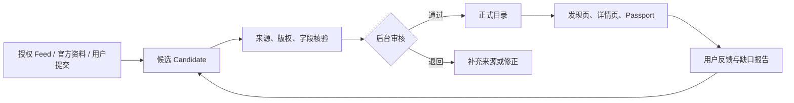
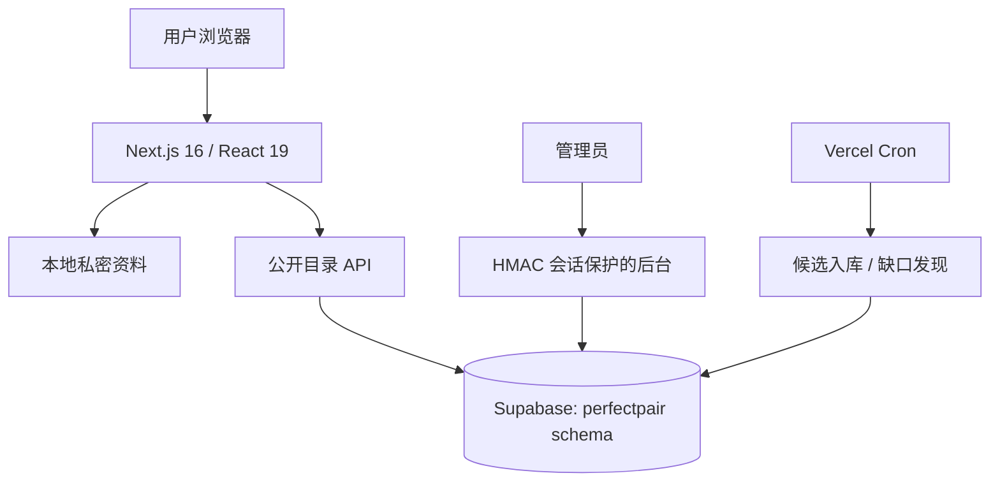

# PerfectPair 完整项目说明

> 更新日期：2026-09-16
> 线上站点：[perfectpair-theta.vercel.app](https://perfectpair-theta.vercel.app/) · 管理后台：[Admin Console](https://perfectpair-theta.vercel.app/admin)

PerfectPair 是一个面向文胸（Bras）和丝袜（Tights）的私密穿着决策平台。它不把商品销售、联盟佣金或品牌关系当作推荐依据；目标是让用户以尽量少、但真正有用的资料，找到更适合的产品，并理解“为什么”。

**核心原则：Money Never Changes Match**。赞助、佣金与商务合作不得改变 Personal Match 或 Community Score。

## 1. 当前状态

| 模块 | 状态 | 当前内容 |
| --- | --- | --- |
| 用户资料与隐私 | MVP 完成 | 渐进式填写、本地优先的私密资料、资料快照、修改与重置。 |
| 产品与品牌资料库 | MVP 完成 | 独立数据库 schema、来源证据、候选审核、人工发布；正式目录 10 条。 |
| 评分与匹配 | 基础完成 | 结构化评分模型、可解释匹配和评论审核入口；真实评分样本尚待积累。 |
| 更新与补全 | 基础完成 | 定时任务、候选队列、用户补充、缺口发现和审核机制；未接入长期授权商业 Feed。 |

当前上线的正式产品为 **5 款文胸 + 5 款丝袜**。每条已发布记录均有官方产品页作为事实来源；没有可靠依据的字段明确显示为未核实，而不是靠猜测填补。

## 2. 用户资料与隐私

用户资料应当“少填能用，愿意填时更准”。所有问题可跳过，只有在回答能改善具体结果时才继续追问。

| 层级 | 典型资料 | 带来的改善 |
| --- | --- | --- |
| 快速开始 | 品类、常穿尺码、主要目标和困扰 | 初步筛选 |
| 核心适配 | 文胸底围/罩杯感受、肩带/钢圈偏好；丝袜身高体重区间、压力和腰头偏好 | 尺码与结构排序 |
| 精确调校 | 胸型、根部、丰满度；腿长感受、腹臀腿比例、材质敏感度、场景 | 更具体的“适合/注意”解释 |
| 使用反馈 | 已购买尺码、哪里合适或不合适、身体变化 | 下一次推荐修正 |

MVP 的私密资料默认只保存在用户当前浏览器，不会公开到社区。系统不要求真实姓名、照片、身体扫描或外貌评分；用户可随时更新、删除、重置和跳过。以后如果加入账户及跨设备同步，必须先落实字段级同意、最小化收集、加密、导出/删除、访问审计、保留期限及面向目标市场的合规流程。

深入设计见：[隐私资料蓝图](privacy-profile-blueprint.md) 与 [资料收集和匹配研究](profile-data-and-matching-research.md)。

## 3. 产品与品牌资料库

资料库追求的是“可追溯的广覆盖”，而不是未经授权的全网复制。每个产品可记录：

- 品牌、型号、品类、官方链接、地区、来源时间；
- 文胸的款型、钢圈、衬垫、罩杯/底围范围、肩带、闭合、面料；
- 丝袜的 DEN、压力、材质、腰头、裆部、足尖、尺码范围和适用场景；
- 逐字段来源、权利状态、证据说明、版本历史与审核状态。

正式目录：

| 文胸 | 丝袜 |
| --- | --- |
| Wacoal Basic Beauty Spacer Underwire T-Shirt Bra | FALKE Pure Matt 50 DEN Women Tights |
| Natori Feathers Full Figure Contour Underwire Bra | Wolford 50 Tights |
| Natori Verge Convertible Plunge Contour Underwire Bra | Wolford 70 Eco Tights |
| Natori Flora Contour Underwire Bra | Calzedonia Rajstopy cienkie Matt 20 den |
| Natori Graceful Full Fit Balconette Contour Underwire Bra | Calzedonia Rajstopy cienkie Control Top 30 den |

资料来源必须遵守：仅保存必要的结构化事实与来源 URL；不复制品牌图片、商品详情全文、第三方用户评论或受限制的价格数据。价格、库存和促销需要来源时间，过期即重验或显示未知。

策略研究：[资料新鲜度和版权研究](catalog-freshness-and-rights-research.md)、[品牌资料获取计划](brand-source-acquisition-plan.md)、[非联盟资料库策略](non-affiliate-catalog-strategy.md)、[持续覆盖执行手册](catalog-continuous-coverage-playbook.md)。

## 4. 评分、匹配与社区

评分不应该只是一个笼统星级。建议按适配维度拆开：尺寸准确性、舒适度、承托/压力、耐穿、版型、特定场景适用性，以及对相近资料用户的参考价值。Personal Match 和公开评分是两回事：评价高的产品不一定适合某位用户。

当前具备可解释匹配、结构化评价的数据模型和后台审核基础。开放真实评论前需要完成反垃圾/举报、人工审核、可信度标签、隐私过滤和最小样本量规则。样本不足时，必须显示“资料不足”，而不能伪造平均分或排名。

## 5. 持续更新、缺口与审核



已配置 Vercel Cron：

- 每日 04:10 UTC：`/api/ingestion/run`，处理目录候选与缺口发现；
- 每日 04:25 UTC：`/api/ingestion/refresh/pricing`，处理允许更新的价格候选。

自动化**只创建候选，永不直接公开发布**。启用任何真实外部来源前，必须记录明确许可、字段范围、使用期限、刷新频率、robots/条款检查和下线方式。用户可在 `/contribute` 提交遗漏产品或更正；这些内容先进入私有审核，不会自动公开。

## 6. 技术架构



| 层 | 技术 |
| --- | --- |
| 应用 | Next.js 16、React 19、TypeScript、Tailwind CSS |
| 数据库 | Supabase PostgreSQL；专用 `perfectpair` schema |
| 校验 | Zod |
| 后台认证 | 环境变量访问码 + HMAC 签名的 HTTP-only session，12 小时有效 |
| 部署与自动化 | Vercel + Vercel Cron |

主要目录：

```text
src/app/                   页面与 API Routes
src/components/            Discover、Passport、Compare、后台界面
src/lib/                   目录、匹配、审核、认证、更新逻辑
supabase/migrations/       数据库迁移
supabase/shared-project/   共享 Supabase 的隔离部署说明
public/                    静态资源
vercel.json                Cron 配置
```

## 7. 本地开发和部署

```powershell
npm install
Copy-Item .env.example .env.local
npm run dev
```

本地打开 `http://localhost:3000`。提交前运行：

```powershell
npm run lint
npm run build
```

环境变量：

| 变量 | 用途 | 规则 |
| --- | --- | --- |
| `NEXT_PUBLIC_SUPABASE_URL` | Supabase 地址 | 在部署设置中维护 |
| `NEXT_PUBLIC_SUPABASE_ANON_KEY` | 浏览器匿名访问 | 在部署设置中维护 |
| `SUPABASE_SERVICE_ROLE_KEY` | 服务器管理访问 | 绝不提交或公开 |
| `CRON_SECRET` | 定时任务授权 | 绝不提交或公开 |
| `ADMIN_ACCESS_CODE` | 后台访问码 | 绝不提交或公开 |
| `ADMIN_SESSION_SECRET` | 后台会话签名 | 绝不提交或公开 |

仓库的 `.env.example` 只包含占位符；真实密钥仅放在 `.env.local` 与 Vercel 加密环境变量。

当前 Supabase 项目与其他应用共用，**禁止运行 `supabase db push`**。请执行：

```powershell
npm run generate:shared-schema
```

然后只在 Supabase SQL Editor 运行生成的隔离 SQL，并暴露 `perfectpair` schema。具体见 [共享项目部署说明](supabase/shared-project/README.md)。

部署到 Vercel 后检查主页、`/discover`、`/passport`、产品页、`/contribute`、`/admin`、`/api/products` 与 Cron 日志。不要把真实访问码写进 Git、issue 或截图。

## 8. 后台运营流程

1. 在 `/admin` 使用管理访问码进入。
2. 用“手工候选录入”加入官方来源产品，填写事实字段、来源 URL、来源类型和权利证据。
3. 审核品牌、产品 URL、公开字段、重复项、版权状态与来源日期。
4. 通过后才发布为正式目录；资料不足则退回或保留为候选。
5. 定期处理缺口队列、用户提交和定时任务结果。

运营人员不得上传/复制未经授权的图片、商品全文或第三方评论；不得把用户私密资料放进候选、评价或运营备注。

## 9. 已知限制与下一步

以下项目仍未完成，不能对外宣传为已实现：

1. `/compare` 与 `/api/match` 仍读取开发期 mock fixtures，尚未完全切换为线上 Supabase 正式目录。
2. 尚无长期运行的授权商业 Feed；Cron 基础设施已就绪，但不可把无授权来源接入自动抓取。
3. 真实用户评分、价格历史、库存状态及全品牌覆盖仍在建设；当前 10 条产品是高可信起点，不代表全量目录。
4. 跨设备账户同步、云端资料导出/删除 API 尚未上线，当前是本地优先资料体验。

建议顺序：先将 Compare/Match 迁移到正式目录；随后持续录入高需求官方产品；再上线审核型评分；最后逐个接入有书面许可的 Feed，并在隐私合规后评估账户与同步。

## 10. 研究与决策资料

- [行业和体验基准](research-benchmark.md)
- [隐私资料蓝图](privacy-profile-blueprint.md)
- [资料收集和匹配研究](profile-data-and-matching-research.md)
- [目录新鲜度与版权研究](catalog-freshness-and-rights-research.md)
- [品牌资料获取计划](brand-source-acquisition-plan.md)
- [非联盟资料库策略](non-affiliate-catalog-strategy.md)
- [目录持续覆盖执行手册](catalog-continuous-coverage-playbook.md)
- [设计质量检查](design-qa.md)

## 11. 变更记录

### 2026-09-16

- 使用 Supabase 独立 `perfectpair` schema 上线正式资料库和后台；
- 发布 5 款文胸与 5 款丝袜的官方来源产品；
- 建立候选、审核、发布、用户补充和 Cron 更新基础链路；
- 将丝袜足尖未知状态明确保留为 `not_verified`；
- 完成本项目 GitHub 交接文档。
